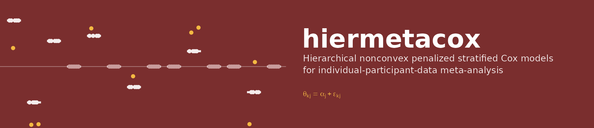

<p align="center">
  
</p>

<p align="center">
  <a href="#method">Method</a> &middot;
  <a href="#installation">Installation</a> &middot;
  <a href="#which-script-produces-which-table">Tables</a> &middot;
  <a href="#which-script-produces-which-figure">Figures</a> &middot;
  <a href="#reproducing-the-results">Reproducing</a> &middot;
  <a href="#notes-on-use">Notes</a> &middot;
  <a href="#citation">Citation</a>
</p>

---

Hierarchical variable selection for individual-participant-data (IPD)
meta-analysis of time-to-event outcomes. Each study keeps its own baseline
hazard; each log-hazard ratio is split into a **global effect** shared across
studies and a **sparse study-specific deviation**; MCP or SCAD penalties with two
tuning parameters select both, and a covariate removed globally is removed from
every study.

Code accompanying *Hierarchical Variable Selection for Nonconvex Penalized Cox
Models in Individual-Participant-Data Meta-Analysis* by Emmanuel Djegou, Bertin
Dehigbe, Jarrad Botchway and Emmanuel Boamah. The R package `hiermetacox` in this
repository implements the method; the `simulation/` and `application/` scripts
reproduce every table and figure of the paper.

---

## Method

For participant `i` of study `k = 1..K`:

```
h_ki(t | x_ki)  =  h_0k(t) * exp( x_ki' theta_k )        stratified Cox model
theta_kj        =  alpha_j + eps_kj                       global + deviation
```

* `h_0k` is an unknown baseline hazard, different in every study, removed by the
  stratified partial likelihood (risk sets never mix studies).
* `alpha` and `eps_k` are **unknown fixed parameters**, not random effects; no
  distribution is assumed for the deviations.

The estimator minimises

```
Q = -(1/N) sum_k l_k(alpha + eps_k)
    + sum_j P(|alpha_j|; lambda_alpha)
    + sum_k sum_j P(omega_k |eps_kj|; lambda_eps),        omega_k = sqrt(n_k / N)
```

over the set `H` defined by two rules:

| Rule | Statement | Why |
|---|---|---|
| Hierarchy | `alpha_j = 0  =>  eps_kj = 0` for all `k` | a globally excluded covariate is excluded everywhere |
| Sharing | every active covariate has at least one study with `eps_kj = 0` | identifies `alpha_j` as the effect shared by non-deviating studies |

The sharing rule replaces the zero-sum constraint of the first version of the
paper, which is incompatible with sparse deviations (one deviating study would
force all others to deviate).

**Algorithm.** Pathwise coordinate descent on the diagonal quadratic surrogate of
the stratified partial likelihood, written in C. Each covariate block
`(alpha_j, eps_1j, ..., eps_Kj)` is updated by exact one-dimensional minimisation
(valid even where the MCP/SCAD coordinate problem is nonconvex), never leaves
`H`, and ends with a likelihood-preserving re-centring move. A step is accepted
only if the true objective does not increase (step-halving otherwise).

**Tuning.** `(lambda_alpha, lambda_eps)` are chosen jointly by `V = 5`-fold
cross-validation over 20 values of `lambda_alpha` times the ratios
`lambda_eps / lambda_alpha` in `{0.5, 1, 2}`. Folds are stratified by study and
event status; the criterion is the cross-validated linear-predictor deviance of
the stratified partial likelihood (Dai & Breheny, 2019). Both the minimum rule
and a one-standard-error rule (fewest nonzero parameters within one SE) are
returned from the same run.

---

## Repository structure

```text
.
├── hiermetacox/                    # the R package
│   ├── src/hmcox.c                   stratified hierarchical coordinate descent (C)
│   ├── R/hmcox.R                     data preparation, path fit, coef/predict
│   ├── R/cv.R                        2-D cross-validation, fold assignment, both rules
│   ├── R/inference.R                 post-selection Wald inference, bootstrap,
│   │                                 simulation generator sim_ipd(), metrics
│   └── tests/testthat/               solver correctness tests
│
├── simulation/                     # Section 5
│   ├── 00_setup.R                    scenarios, tuning constants, competitor wrappers
│   ├── 01_run_simulation.R           Monte Carlo runner; resumable
│   ├── 02_make_tables_figures.R      aggregates results WITHOUT refitting
│   ├── run_all.sh                    driver (R = 25 replicates per scenario)
│   └── results/                      per-replicate CSVs, summaries, run log
│
├── application/                    # Section 6
│   ├── 01_prepare_data.R             curatedOvarianData -> analysis data (p = 500)
│   ├── 02_fit_and_infer.R            8 methods, inference, bootstrap, frailty,
│   │                                 fold sensitivity, leave-one-study-out validation
│   ├── 03_make_tables_figures.R      tables and figures from stored results
│   └── results/                      CSV/RDS outputs and logs
│
├── manuscript/
│   ├── main.tex, references.bib
│   ├── tables/                       .tex tables written by the scripts (\input)
│   └── figures/                      .pdf figures written by the scripts
│
├── scripts/
│   ├── quick_test.R                  run this first (~1 min)
│   └── audit_consistency.R           code <-> manuscript consistency check
│
├── docs/header.png
├── CITATION.cff
└── LICENSE
```

All paths are relative to the repository root.

---

## Which script produces which table

Tables are written as LaTeX fragments and included with `\input`, so the numbers
in the paper are the numbers the code computed; nothing is transcribed by hand.

| Table | Contents | Produced by | Output |
|---|---|---|---|
| 1 | Simulation scenarios | `simulation/02_make_tables_figures.R` | `manuscript/tables/tab_scenarios.tex` |
| 2 | Base scenario, all methods, both rules | same | `tab_sim_base.tex` |
| 3 | Coverage of post-selection Wald intervals | same | `tab_sim_coverage.tex` |
| 4 | Cohort characteristics | `application/03_make_tables_figures.R` | `tab_cohorts.tex` |
| 5 | Genes selected by each method | same | `tab_app_methods.tex` |
| 6 | Selected genes: HR, 95% CI, p, stability | same | `tab_app_genes.tex` |
| 7 | Stratified vs frailty vs pooled hazard ratios | same | `tab_app_frailty.tex` |
| 8 | Leave-one-study-out C-index | same | `tab_app_loso.tex` |
| A1 | All scenarios, all methods | `simulation/02_make_tables_figures.R` | `tab_sim_all.tex` |

Long-format results with Monte Carlo standard errors are in
`simulation/results/sim_summary.csv`; per-replicate results are in
`simulation/results/sim_raw_*.csv`.

---

## Which script produces which figure

| Figure | Contents | Produced by | Output file |
|---|---|---|---|
| 1 | MCC by scenario, both rules | `simulation/02_make_tables_figures.R` | `manuscript/figures/sim_mcc.pdf` |
| 2 | FDR and TPR by scenario | same | `sim_fdr_tpr.pdf` |
| 3 | MSE of study-specific effects | same | `sim_mse_theta.pdf` |
| 4 | Recovery of deviations | same | `sim_deviations.pdf` |
| 5 | Kaplan–Meier curves by cohort | `application/03_make_tables_figures.R` | `app_km.pdf` |
| 6 | Two-dimensional CV curve | same | `app_cv_surface.pdf` |
| 7 | Global and study-specific hazard ratios | same | `app_forest.pdf` |
| 8 | Bootstrap selection frequencies | same | `app_stability.pdf` |

**These filenames are fixed by the `\includegraphics` calls in `main.tex` and must
not be changed.** `manuscript/figures/` and `manuscript/tables/` are exactly the
directories the `.tex` file reads, so rerunning the scripts updates the paper
without path edits.

---

## Installation

```bash
git clone https://github.com/EmmanuelMasavoDjegou/Hierarchical-Variable-Selection-in-Penalized-Cox-Models-for-IPD-Meta-Analysis.git
cd Hierarchical-Variable-Selection-in-Penalized-Cox-Models-for-IPD-Meta-Analysis
R CMD INSTALL hiermetacox          # needs a C compiler (Rtools on Windows)
```

or, from R, `remotes::install_github("EmmanuelMasavoDjegou/Hierarchical-Variable-Selection-in-Penalized-Cox-Models-for-IPD-Meta-Analysis", subdir = "hiermetacox")`.

The package itself depends only on `survival`. The reproduction scripts also use:

```r
install.packages(c("glmnet", "ncvreg", "ggplot2", "testthat"))
if (!requireNamespace("BiocManager", quietly = TRUE)) install.packages("BiocManager")
BiocManager::install(c("Biobase", "curatedOvarianData"))
```

Results in the paper were produced with R 4.3.3, survival 3.5-8, glmnet 4.1-8 and
ncvreg 3.16.0.

### Quick start

```r
library(hiermetacox)
set.seed(1)
sim <- sim_ipd(K = 5, n = 200, p = 100)                  # the base simulation design
d   <- sim$data
X   <- as.matrix(d[, -(1:3)])

fit <- cv.hmcox(X, d$time, d$status, d$study, penalty = "MCP",
                nfolds = 5, ratio = c(0.5, 1, 2), rule = "1se")
fit                                   # selected tuning parameters, model size
cf  <- coef(fit)                      # alpha (p), eps (K x p), theta (K x p)
hmcox_inference(fit)$global           # HR, 95% CI, p-value per selected covariate
hmcox_boot(fit, B = 100)$selection    # bootstrap selection frequencies
```

---

## Verify the installation

```bash
Rscript -e 'testthat::test_dir("hiermetacox/tests/testthat")'   # ~1 min
Rscript scripts/quick_test.R                                    # ~1 min
```

The tests check the solver against **exact** references rather than
plausibility:

* with no penalty, the common-effect fit equals `survival::coxph(... + strata(study))`
  with Breslow ties, coefficients and log-likelihood;
* with no penalty, the heterogeneous fit equals `K` separate Cox fits;
* the lasso path equals `glmnet`'s stratified Cox path;
* MCP and SCAD solutions satisfy the Karush–Kuhn–Tucker conditions;
* every fitted model satisfies the hierarchy and the sharing rule at every
  `lambda`, and every training fold contains every study.

`quick_test.R` runs two replicates of the simulation and the table builder
through the same code paths as the full study.

---

## Reproducing the results

### Simulation (Section 5)

```bash
cd simulation
./run_all.sh                         # 13 scenarios x 8 methods, R = 25 replicates
Rscript 02_make_tables_figures.R     # Tables 1-3, A1 and Figures 1-4
```

**About 1.3 hours on one core** (R = 25, the setting used in the paper). Each replicate is appended to
`results/sim_raw_<scenario>.csv` as soon as it finishes, and the runner skips
replicates already on disk, so the run is resumable: re-issue the same command
after any interruption. Replicate `r` of scenario `s` uses
`set.seed(20260000 + 1000 * s + r)`, so any single replicate can be regenerated
in isolation. `02_make_tables_figures.R` refits nothing and reports the number of
replicates per scenario it found.

### Real data (Section 6)

```bash
cd application
Rscript 01_prepare_data.R            # Table 4 data, p = 500 genes
Rscript 02_fit_and_infer.R           # all fits, inference, validation (~15 min)
Rscript 03_make_tables_figures.R     # Tables 4-8 and Figures 5-8
```

The small CSV outputs behind every application table are committed in
`application/results/`. The fitted-model objects (`*.rds`, about 60 MB) are not
committed; `01_prepare_data.R` and `02_fit_and_infer.R` regenerate them, and
`03_make_tables_figures.R` needs them.

---

## Data availability

| Data set | Studies | N | p | Status |
|---|---|---|---|---|
| Simulation | 5–10 | 500–1,000 | 100–500 | generated by `sim_ipd()` |
| curatedOvarianData | 6 | 1,446 (735 deaths) | 500 | public, Bioconductor |

The six cohorts are TCGA, GSE32062.GPL6480, GSE9891, GSE26712, GSE17260 and
GSE30161 from the Bioconductor package **curatedOvarianData** (Ganzfried et al.,
2013). If the package cannot be installed, set `COD_DATA_DIR` to a folder holding
the `*_eset.rda` files, for example the `data/` folder of
https://github.com/waldronlab/curatedOvarianData. The 500 genes are chosen
without using the outcome: genes measured in all six cohorts (12,249) are ranked
by their average within-cohort interquartile-range rank and the top 500 are kept.

---

## Notes on use

**Coefficients are per within-study standard deviation.** `hmcox()` standardises
each covariate within each study by default, so `exp(alpha_j)` is a hazard ratio
per one-SD increase in the study's own distribution. This removes platform and
batch scale differences between cohorts, which is why it is the default.

**Which tuning rule.** Use `rule = "1se"` when the goal is a short list of
covariates, and `rule = "min"` when the goal is estimating study-specific effects
or prediction. The simulation supports this split; in the ovarian data the two
rules give 2 and 6 genes respectively. Both rules come from one CV run
(`coef(fit, rule = "min")`, `coef(fit, rule = "1se")`).

**Wald intervals are conditional on the selected model.** `hmcox_inference()`
refits the unpenalised stratified Cox model on the selected support. The oracle
theorem makes these intervals asymptotically valid under correct selection; in
finite samples they ignore selection uncertainty. Read them next to the bootstrap
selection frequencies from `hmcox_boot()`, and see Table 3 for their empirical
coverage.

**A small `alpha_j` with large deviations is a signal, not noise.** Under the
hierarchy a covariate that acts in only a minority of studies must still have a
nonzero global effect. The fit then keeps `alpha_j` small and puts the effect in
the deviations; the first-order condition for `alpha_j` then holds only as an
inequality (the constraint is active). Such covariates are the study-specific
signals the method is designed to expose.

**Prediction for a new study uses `alpha` only.** Deviations are fixed effects of
the observed studies. `predict()` uses `alpha` for any study label not seen in
training, which is what the leave-one-study-out validation does.

**The path is truncated at 100 active global effects** (`dfmax`), and the smallest
`lambda_alpha` is 5% of the largest. Models beyond this range were never selected
by cross-validation in our runs (`boundary` column of the simulation output).

---

## Audit

```bash
Rscript scripts/audit_consistency.R
```

checks that every `\input` table and `\includegraphics` figure in `main.tex`
exists and was produced by the scripts, that the tuning constants stated in the
manuscript (folds, ratio grid, grid length, `kappa`, `d_max`, replicate count,
dimensions) equal those in `simulation/00_setup.R`, and that every citation key
resolves in `references.bib`.

---

## Citation

If you use this code, please cite the paper:

> **E. Djegou**, B. Dehigbe, J. Botchway & E. Boamah. *Hierarchical Variable
> Selection for Nonconvex Penalized Cox Models in Individual-Participant-Data
> Meta-Analysis.* Preprint.

Machine-readable metadata is in `CITATION.cff`. The code is released under the
MIT licence; see `LICENSE`.
